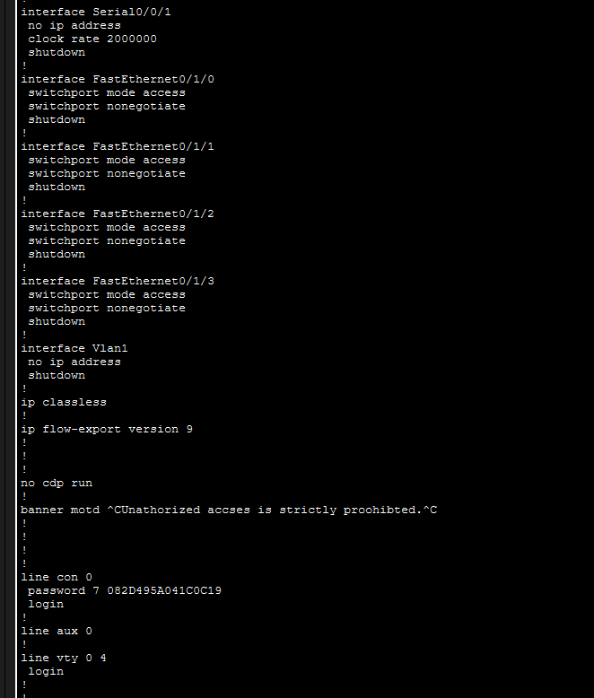
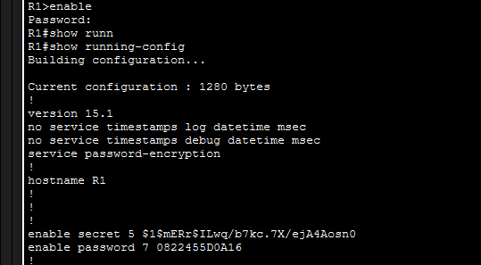

# Lab 10.1.4 - Configure Initial Router Settings

## 📌 Objective

Configure basic router settings and secure access.

## 🛠️ Tasks Completed

* Set hostname (R1)
* Disabled DNS lookup
* Configured enable secret
* Secured console and VTY access
* Enabled password encryption
* Configured interface IP address
* Activated interface (no shutdown)
* Added MOTD banner

## 📷 Screenshots

### Banner-LineConsole Configuration

### Topology Status

### Running-Config

### IP

