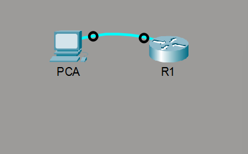
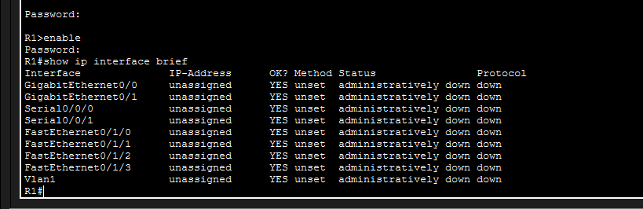

# ⚙️ 10.1.4 Configure Initial Router Settings — Cisco Packet Tracer Lab

> Configure essential initial settings on a Cisco router including hostname, passwords, banner, and IP interface verification.

---

## 📋 Overview

This lab walks through the initial configuration of a Cisco router (R1) from scratch. It covers setting the hostname, enabling secret and console passwords, password encryption, a MOTD banner, and verifying interface status.

**File:** `10_1_4_Packet_Tracer_-_Configure_Initial_Router_Settings.pka`  
**Platform:** Cisco Packet Tracer  
**Devices:** R1, PCA

---

## 🖧 Network Topology



A single router (**R1**) is connected directly to a PC (**PCA**) via a console or Ethernet cable.

---

## 🛠️ Configuration Steps

### Step 1 — Set Hostname, Enable Secret & Password Encryption

Enter global configuration mode and configure the hostname, enable secret, and enable password. Then apply `service password-encryption` to hash all plaintext passwords:

```
Router> enable
Router# configure terminal
Router(config)# hostname R1
R1(config)# enable secret <password>
R1(config)# enable password <password>
R1(config)# service password-encryption
```

The running config shows the enable secret stored as a **Type 5** (MD5) hash and the enable password as a **Type 7** hash:


---

### Step 2 — Configure MOTD Banner & Console Password

Set a Message of the Day banner to warn unauthorised users, and secure the console line with a password:

```
R1(config)# banner motd ^C Unauthorized access is strictly prohibited. ^C
R1(config)# line con 0
R1(config-line)# password <password>
R1(config-line)# login
```

The banner and console line configuration as seen in the running config:


---

### Step 3 — Verify IP Interface Status

Use `show ip interface brief` to verify the status of all interfaces on the router:

```
R1# show ip interface brief
```



All interfaces show **administratively down/down** until they are configured with an IP address and brought up with the `no shutdown` command.

---

## 📌 Key Concepts

| Concept | Detail |
|---|---|
| **`enable secret`** | Type 5 (MD5) hash — stronger than `enable password` |
| **`enable password`** | Type 7 hash after `service password-encryption` is applied |
| **`service password-encryption`** | Encrypts all plaintext passwords in the config |
| **`banner motd`** | Displays a warning message at login |
| **`line con 0`** | Secures physical console port access |
| **`show ip interface brief`** | Displays status and IP of all interfaces |
| **Up/Up** | Interface is active and connected |
| **Administratively Down** | Interface disabled with `shutdown` command |

---

## 📁 Repository Structure

```
.
├── 10_1_4_Packet_Tracer_-_Configure_Initial_Router_Settings.pka
├── README.md
└── ScreenShot/
    ├── Topology.png
    ├── Running-Config.png
    ├── Banner-LineConsole.png
    └── IP.png
```

---

## 🚀 Getting Started

1. Open Cisco Packet Tracer
2. Load `10_1_4_Packet_Tracer_-_Configure_Initial_Router_Settings.pka`
3. Click on **R1** and open the **CLI** tab
4. Follow the steps above to apply the initial router configuration
