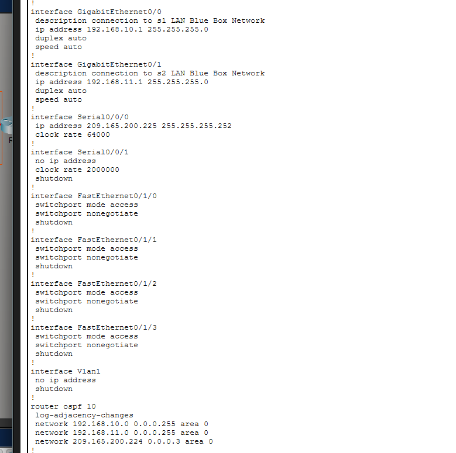

# Lab 10.3.4 - Basic Router Configuration

## 📌 Objective

Configure router interfaces and verify connectivity.

## 🛠️ Tasks Completed

* Configured router interfaces (IP addressing)
* Activated interfaces (no shutdown)
* Verified interface status
* Tested connectivity (ping)

## 📷 Screenshots

### Topology

### Interface Configuration

### IP

