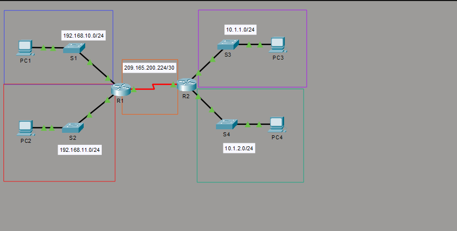
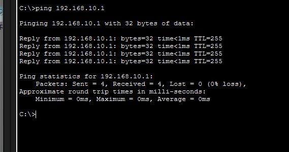
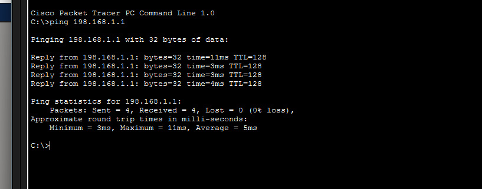
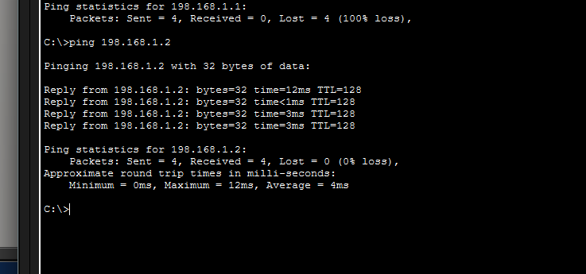

# ⚙️ 10.3.4 Connect a Router to a LAN — Cisco Packet Tracer Lab

> Configure router interfaces with IP addresses and descriptions, then verify LAN connectivity using ping across multiple networks.

---

## 📋 Overview

This lab walks through connecting a Cisco router (R1) to multiple LANs by configuring GigabitEthernet and Serial interfaces. It covers assigning IP addresses, adding interface descriptions, enabling interfaces, and verifying end-to-end connectivity with ping tests.

**File:** `10_3_4_Packet_Tracer_-_Connect_a_Router_to_a_LAN.pka`  
**Platform:** Cisco Packet Tracer  
**Devices:** R1, R2, S1, S2, S3, S4, PC1, PC2, PC3, PC4

---

## 🖧 Network Topology



Two routers (**R1** and **R2**) are interconnected via a Serial WAN link (`209.165.200.224/30`). R1 serves two LANs through switches S1 and S2, while R2 serves two additional LANs through S3 and S4.

| Network | Subnet | Connected Device |
|---|---|---|
| LAN 1 | 192.168.10.0/24 | R1 G0/0 ↔ S1 ↔ PC1 |
| LAN 2 | 192.168.11.0/24 | R1 G0/1 ↔ S2 ↔ PC2 |
| WAN | 209.165.200.224/30 | R1 S0/0/0 ↔ R2 S0/0/0 |
| LAN 3 | 10.1.1.0/24 | R2 ↔ S3 ↔ PC3 |
| LAN 4 | 10.1.2.0/24 | R2 ↔ S4 ↔ PC4 |

---

## 🛠️ Configuration Steps

### Step 1 — Configure GigabitEthernet Interfaces on R1

Assign IP addresses and descriptions to R1's LAN-facing interfaces, then bring them up:

```
R1> enable
R1# configure terminal
R1(config)# interface GigabitEthernet0/0
R1(config-if)# description connection to s1 LAN Blue Box Network
R1(config-if)# ip address 192.168.10.1 255.255.255.0
R1(config-if)# no shutdown

R1(config)# interface GigabitEthernet0/1
R1(config-if)# description connection to s2 LAN Blue Box Network
R1(config-if)# ip address 192.168.11.1 255.255.255.0
R1(config-if)# no shutdown
```

---

### Step 2 — Configure the Serial WAN Interface on R1

Assign an IP address to the Serial interface connecting R1 to R2 and set the clock rate (DCE side):

```
R1(config)# interface Serial0/0/0
R1(config-if)# ip address 209.165.200.225 255.255.255.252
R1(config-if)# clock rate 64000
R1(config-if)# no shutdown
```

The running config confirms all interface addresses, descriptions, and OSPF routing:


---

### Step 3 — Verify Connectivity with Ping

#### Ping the Default Gateway (PC1 → R1 G0/0)

From PC1, ping R1's GigabitEthernet0/0 interface to confirm local LAN connectivity:

```
C:\>ping 192.168.10.1
```



All 4 packets received with **0% loss** — LAN 1 is fully operational.

---

#### Ping Across the WAN (PC1 → R2)

From PC1, ping R2 to verify routing across the Serial WAN link:

```
C:\>ping 198.168.1.1
```



All 4 packets received — inter-router connectivity is confirmed.

---

#### Ping Remote LAN Hosts (PC1 → Remote Host)

From PC1, ping hosts in R2's LANs to confirm full end-to-end routing:

```
C:\>ping 198.168.1.2
```



Successful replies confirm that OSPF routing is propagating routes correctly across all networks.

---

## 📌 Key Concepts

| Concept | Detail |
|---|---|
| **`interface GigabitEthernet0/0`** | Enters config mode for a GigabitEthernet interface |
| **`ip address`** | Assigns an IPv4 address and subnet mask to an interface |
| **`description`** | Adds a human-readable label to an interface |
| **`no shutdown`** | Brings the interface up from administratively down state |
| **`clock rate 64000`** | Sets the clock rate on the DCE side of a Serial link |
| **`router ospf 10`** | Enables OSPF routing process with process ID 10 |
| **`network`** | Advertises a network into OSPF so routes are shared |
| **`ping`** | Tests end-to-end IP connectivity between devices |

---

## 📁 Repository Structure

```
.
├── 10_3_4_Packet_Tracer_-_Connect_a_Router_to_a_LAN.pka
├── README.md
└── ScreenShot/
    ├── Topology.png
    ├── Running-Config.png
    ├── IP-running.png
    ├── ip-running2.png
    └── ip-running3.png
```

---

## 🚀 Getting Started

1. Open Cisco Packet Tracer
2. Load `10_3_4_Packet_Tracer_-_Connect_a_Router_to_a_LAN.pka`
3. Click on **R1** and open the **CLI** tab
4. Follow the steps above to configure interfaces and verify connectivity
