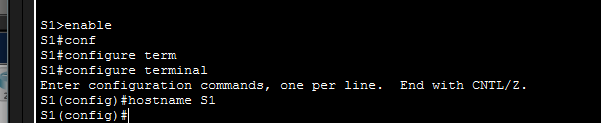

# 🖥️ 2.3.7 Navigate the IOS — Cisco Packet Tracer Lab

> Learn to navigate Cisco IOS modes, use help commands, and run basic show commands on a switch.

---

## 📋 Overview

This lab introduces the Cisco IOS command-line interface (CLI). You will practice switching between IOS modes, using context-sensitive help (`?`), and running `show` commands to inspect device configuration.

**File:** `2_3_7_Packet_Tracer_-_Navigate_the_IOS.pka`  
**Platform:** Cisco Packet Tracer  
**Device:** Cisco Switch S1

---

## 🖧 Network Topology


A single PC (**PC1**) is connected to switch **S1** via a console cable.

---

## 🛠️ Configuration Steps

### Step 1 — Navigate IOS Modes

Switch between User EXEC, Privileged EXEC, and Global Configuration modes:

```
S1> enable
S1# configure terminal
S1(config)# hostname S1
```



---

### Step 2 — Use Context-Sensitive Help

Type `?` at any prompt to list available commands. Use `show ?` in Privileged EXEC mode to see all show options:

```
S1# show ?
```


---

### Step 3 — Run Show Commands

Use `show running-config` to display the current active configuration:

```
S1# show running-config
```


---

## 📌 Key Concepts

| Concept | Detail |
|---|---|
| **User EXEC mode** | `S1>` — limited read-only commands |
| **Privileged EXEC mode** | `S1#` — full access, entered with `enable` |
| **Global Config mode** | `S1(config)#` — entered with `configure terminal` |
| **Context-sensitive help** | Type `?` alone or after a command to list options |
| **Command abbreviation** | IOS accepts shortened commands e.g. `conf t`, `show runn` |
| **`show running-config`** | Displays the active configuration in RAM |

---

## 📁 Repository Structure

```
.
├── 2_3_7_Packet_Tracer_-_Navigate_the_IOS.pka
├── README.md
└── ScreenShot/
    ├── Topology.png
    ├── ios-modes.png
    ├── help-commands.png
    └── show-commands.png
```

---

## 🚀 Getting Started

1. Open Cisco Packet Tracer
2. Load `2_3_7_Packet_Tracer_-_Navigate_the_IOS.pka`
3. Click on **S1** and open the **CLI** tab
4. Follow the steps above to navigate IOS modes and explore commands
