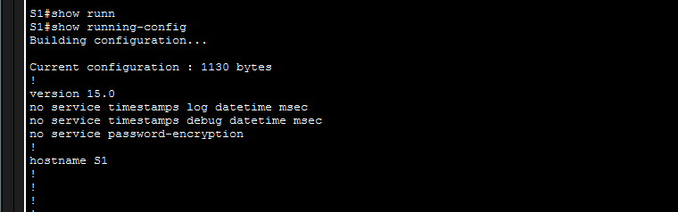
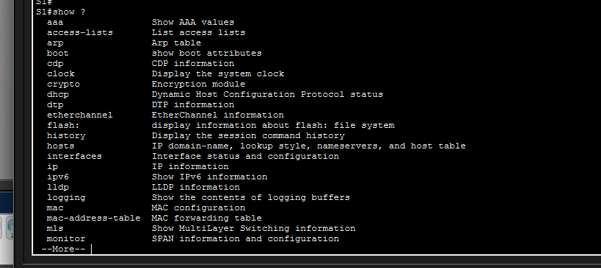

# Lab 2.3.7 - Navigate IOS

## 📌 Objective

Learn how to navigate Cisco IOS and use basic commands.

## 🛠️ Tasks Completed

* Accessed privileged EXEC mode
* Entered global configuration mode
* Changed hostname
* Used `show` commands
* Used command shortcuts (sh run)
* Used help feature (?)

## 📷 Screenshots

### Topology

### IOS-Modes

### Show Commands

### Help Command

