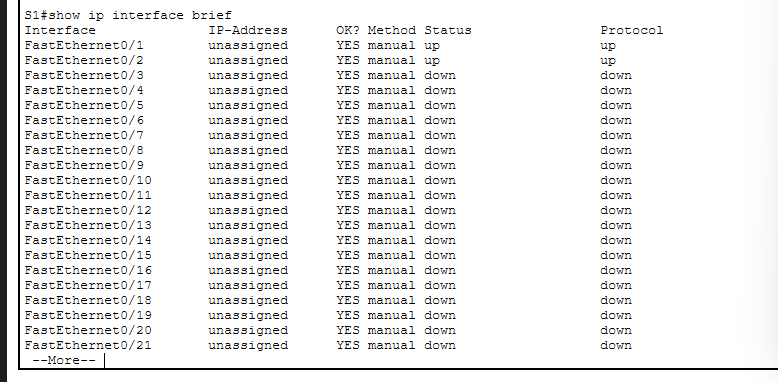

# ⚙️ 2.5.5 Configure Initial Switch Settings — Cisco Packet Tracer Lab

> Configure essential initial settings on a Cisco switch including hostname, passwords, banner, and IP interface verification.

---

## 📋 Overview

This lab walks through the initial configuration of a Cisco switch (S1) from scratch. It covers setting the hostname, enabling secret and console passwords, password encryption, a MOTD banner, and verifying interface status.

**File:** `2_5_5_Packet_Tracer_-_Configure_Initial_Switch_Settings.pka`  
**Platform:** Cisco Packet Tracer  
**Devices:** S1, S2, PC1, PC2

---

## 🖧 Network Topology


Two switches (**S1** and **S2**) are interconnected. Each switch has a PC connected to it (**PC1** and **PC2**).

---

## 🛠️ Configuration Steps

### Step 1 — Set Hostname, Enable Secret & Password Encryption

Enter global configuration mode and configure the hostname, enable secret, and enable password. Then apply `service password-encryption` to hash all plaintext passwords:

```
S1> enable
S1# configure terminal
S1(config)# hostname S1
S1(config)# enable secret <password>
S1(config)# enable password <password>
S1(config)# service password-encryption
```

The running config shows the enable secret stored as a **Type 5** (MD5) hash and the enable password as a **Type 7** hash:


---

### Step 2 — Configure MOTD Banner & Console Password

Set a Message of the Day banner to warn unauthorised users, and secure the console line with a password:

```
S1(config)# banner motd ^C This is a secure system. Authorized Access Only! ^C
S1(config)# line con 0
S1(config-line)# password <password>
S1(config-line)# login
```

The banner and console line configuration as seen in the running config:


---

### Step 3 — Verify IP Interface Status

Use `show ip interface brief` to verify the status of all interfaces on the switch:

```
S1# show ip interface brief
```



Active ports connected to other devices show **up/up** while unused ports show **down/down**.

---

## 📌 Key Concepts

| Concept | Detail |
|---|---|
| **`enable secret`** | Type 5 (MD5) hash — stronger than `enable password` |
| **`enable password`** | Type 7 hash after `service password-encryption` is applied |
| **`service password-encryption`** | Encrypts all plaintext passwords in the config |
| **`banner motd`** | Displays a warning message at login |
| **`line con 0`** | Secures physical console port access |
| **`show ip interface brief`** | Displays status and IP of all interfaces |
| **Up/Up** | Interface is active and connected |
| **Down/Down** | Interface has no cable or link |

---

## 📁 Repository Structure

```
.
├── 2_5_5_Packet_Tracer_-_Configure_Initial_Switch_Settings.pka
├── README.md
└── ScreenShot/
    ├── Topology.png
    ├── config-hostname-enablesecret.png
    ├── banner-config.png
    └── IP.png
```

---

## 🚀 Getting Started

1. Open Cisco Packet Tracer
2. Load `2_5_5_Packet_Tracer_-_Configure_Initial_Switch_Settings.pka`
3. Click on **S1** and open the **CLI** tab
4. Follow the steps above to apply the initial switch configuration
