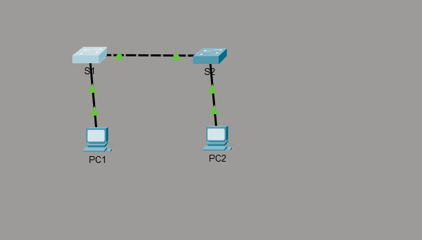
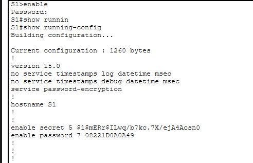
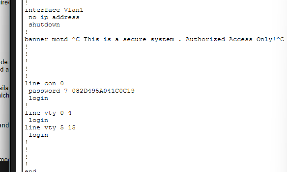

# Lab 2.5.5 - Configure Initial Switch Settings

## 📌 Objective

Configure basic switch settings and secure access.

## 🛠️ Tasks Completed

* Set hostname (S1)
* Disabled DNS lookup
* Configured enable secret
* Secured console and VTY access
* Enabled password encryption
* Configured VLAN 1 IP address
* Set default gateway
* Added MOTD banner

## 📷 Screenshots

### Topology

### Running Configuration

### IP Configuration

### Banner-Config

