# 🌐 3.3.12 VLAN Configuration — Cisco Packet Tracer Lab

> Multi-switch VLAN segmentation with Faculty/Staff, Students, Guest, Management, and Voice VLANs across three interconnected Cisco switches.

---

## 📋 Overview

This lab demonstrates how to create and name VLANs on three Cisco switches (S1, S2, S3), assign access ports to the correct VLANs, configure a Voice VLAN for an IP Phone, and verify end-to-end connectivity between PCs in the same VLAN.

**File:** `3_3_12_Packet_Tracer_-_VLAN_Configuration.pka`  
**Platform:** Cisco Packet Tracer  
**Devices:** Cisco Switches S1, S2, S3 · PC1–PC6 · IP Phone0

---

## 🖧 Network Topology

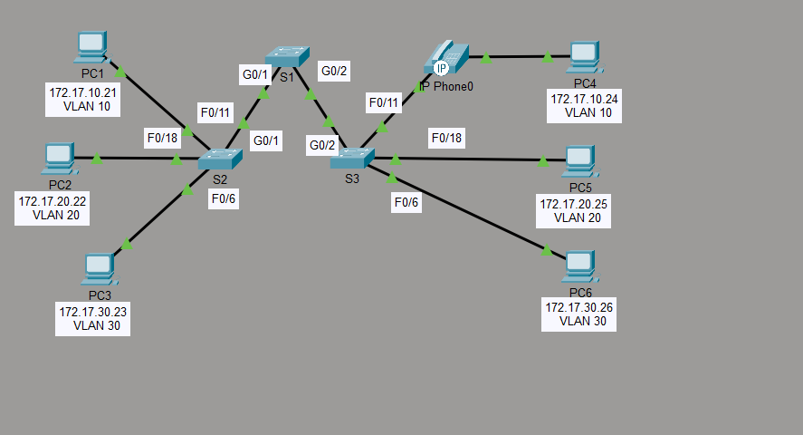

| Device | IP Address | VLAN |
|---|---|---|
| PC1 | 172.17.10.21 | VLAN 10 |
| PC2 | 172.17.20.22 | VLAN 20 |
| PC3 | 172.17.30.23 | VLAN 30 |
| PC4 | 172.17.10.24 | VLAN 10 |
| PC5 | 172.17.20.25 | VLAN 20 |
| PC6 | 172.17.30.26 | VLAN 30 |
| IP Phone0 | — | VLAN 150 (VOICE) |

---

## 🛠️ Configuration Steps

### Step 1 — Create and Name VLANs on S1

Enter global configuration mode and create all five VLANs with their names:

```
S1(config)# vlan 10
S1(config-vlan)# name Faculty/Staff
S1(config-vlan)# vlan 20
S1(config-vlan)# name Students
S1(config-vlan)# vlan 30
S1(config-vlan)# name Guest(Default)
S1(config-vlan)# vlan 99
S1(config-vlan)# name Management&Native
S1(config-vlan)# vlan 150
S1(config-vlan)# name VOICE
```

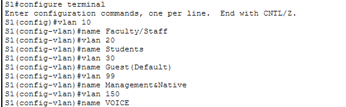

---

### Step 2 — Create and Name VLANs on S2

Repeat the same VLAN creation on S2:

```
S2(config)# vlan 10
S2(config-vlan)# name Faculty/Staff
S2(config-vlan)# vlan 20
S2(config-vlan)# name Students
S2(config-vlan)# vlan 30
S2(config-vlan)# name Guest(Default)
S2(config-vlan)# vlan 99
S2(config-vlan)# name Management&Native
S2(config-vlan)# vlan 150
S2(config-vlan)# name VOICE
```

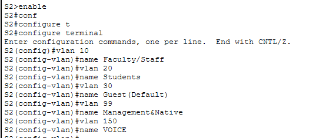

---

### Step 3 — Create and Name VLANs on S3

Repeat the same VLAN creation on S3:

```
S3(config)# vlan 10
S3(config-vlan)# name Faculty/Staff
S3(config-vlan)# vlan 20
S3(config-vlan)# name Students
S3(config-vlan)# vlan 30
S3(config-vlan)# name Guest(Default)
S3(config-vlan)# vlan 99
S3(config-vlan)# name Management&Native
S3(config-vlan)# vlan 150
S3(config-vlan)# name VOICE
```

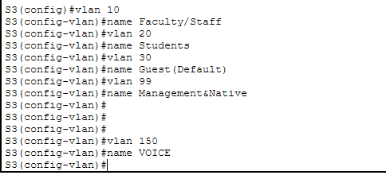

---

### Step 4 — Assign VLANs to Active Ports on S2

Set each active access port on S2 to its corresponding VLAN:

```
S2(config)# interface f0/11
S2(config-if)# switchport mode access
S2(config-if)# switchport access vlan 10
S2(config-if)# exit
S2(config)# interface f0/18
S2(config-if)# switchport mode access
S2(config-if)# switchport access vlan 20
S2(config-if)# exit
S2(config)# interface f0/6
S2(config-if)# switchport mode access
S2(config-if)# switchport access vlan 30
```

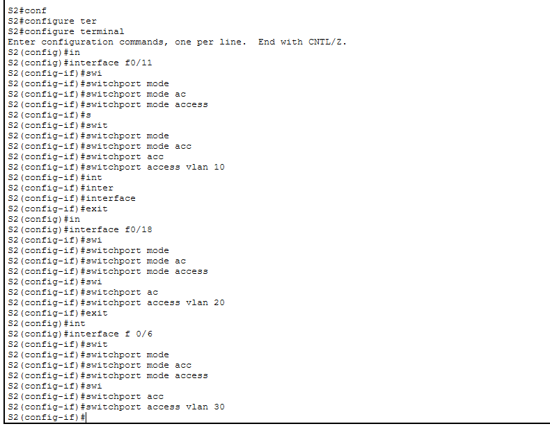

---

### Step 5 — Assign VLANs to Active Ports on S3

Set each active access port on S3 to its corresponding VLAN:

```
S3(config)# interface f0/11
S3(config-if)# switchport mode access
S3(config-if)# switchport access vlan 10
S3(config-if)# exit
S3(config)# interface f0/18
S3(config-if)# switchport mode access
S3(config-if)# switchport access vlan 20
S3(config-if)# exit
S3(config)# interface f0/6
S3(config-if)# switchport mode access
S3(config-if)# switchport access vlan 30
```

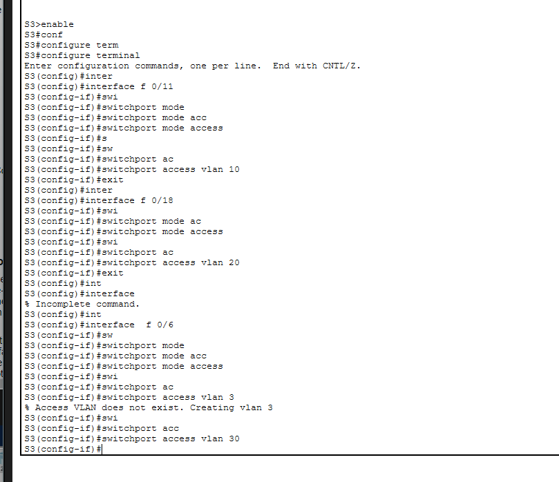

---

### Step 6 — Assign the Voice VLAN to f0/11 on S3

Configure port Fa0/11 on S3 to carry both data (VLAN 10) and voice (VLAN 150) traffic for the IP Phone:

```
S3(config)# interface f0/11
S3(config-if)# mls qos trust cos
S3(config-if)# switchport voice vlan 150
```

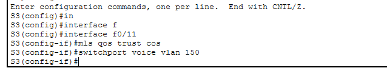

---

## ✅ Verification

### Verify VLANs Created Correctly on S1

```
S1# show vlan brief
```

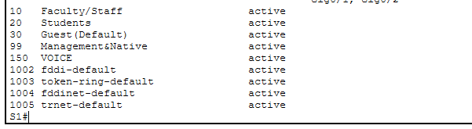

---

### Verify VLANs Created Correctly on S2

```
S2# show vlan brief
```

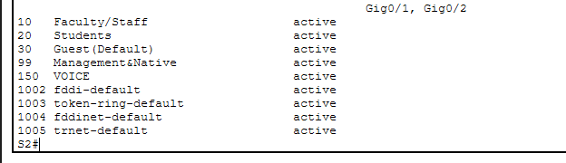

---

### Verify VLANs Created Correctly on S3

```
S3# show vlan brief
```

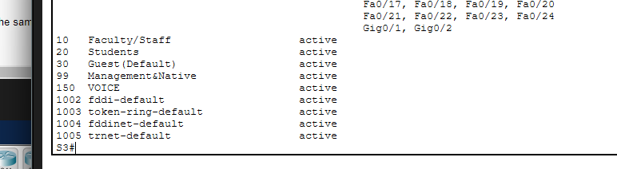

---

### S1 — Show All VLANs Configured

Confirm that all VLANs are active on S1 and no ports are yet assigned (S1 carries only trunk links):

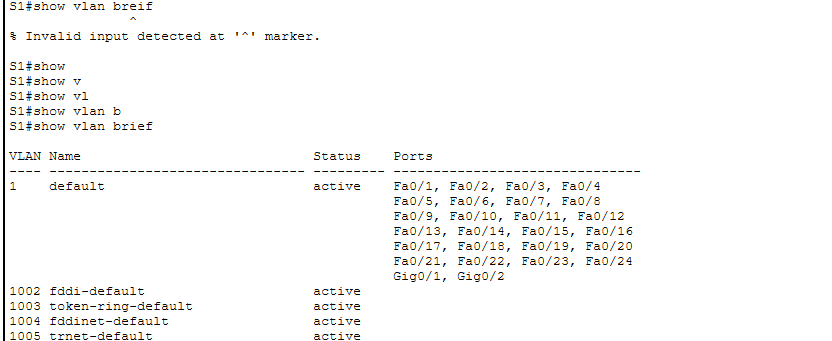

---

### S2 — Verify Each VLAN Assigned to Each Port

Confirm that Fa0/11 → VLAN 10, Fa0/18 → VLAN 20, and Fa0/6 → VLAN 30:

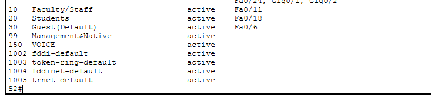

---

### S3 — Verify Each VLAN Assigned to Each Port

Confirm that Fa0/11 → VLAN 10, Fa0/18 → VLAN 20, Fa0/6 → VLAN 30, and VLAN 150 active on Fa0/11:

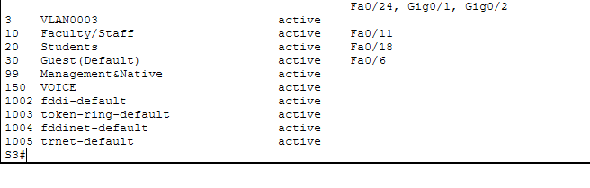

---

### Check Voice VLAN Assigned to f0/11 on S3

Verify VLAN 150 (VOICE) is active and listed under Fa0/11:

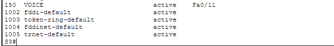

---

### Connectivity Tests

**PC1 → PC4** (both VLAN 10 — Faculty/Staff):


**PC2 → PC5** (both VLAN 20 — Students):

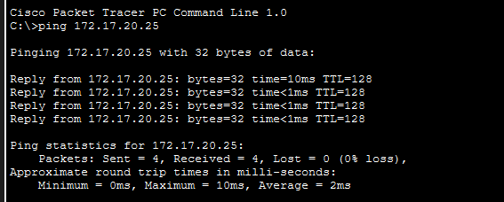

**PC3 → PC6** (both VLAN 30 — Guest):

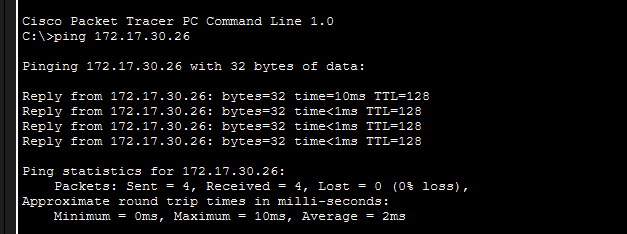

All pings succeed with **0% packet loss**, confirming correct VLAN segmentation and connectivity within each VLAN.

---

## 📌 Key Concepts

| Concept | Detail |
|---|---|
| **VLAN** | Logical segmentation of a switch into separate broadcast domains |
| **Access port** | A port assigned to exactly one VLAN for end-device connections |
| **Voice VLAN** | A dedicated VLAN (150) that carries IP Phone traffic with QoS markings |
| **`mls qos trust cos`** | Trusts the CoS markings sent by an IP Phone for traffic prioritization |
| **`switchport voice vlan`** | Enables a second (voice) VLAN on an access port alongside the data VLAN |
| **`show vlan brief`** | Displays all VLANs, their status, and which ports are assigned to each |
| **VLAN 99** | Configured as Management & Native VLAN for switch management traffic |

---

## 📁 Repository Structure

```
.
├── 3_3_12_Packet_Tracer_-_VLAN_Configuration.pka
├── README.md
└── ScreenShots/
    ├── Topology.png
    ├── Createandname-vlans-On-S1.png
    ├── Createandname-vlans-On-S2.png
    ├── Createandname-vlans-On-S3.png
    ├── Assign-VLANs-to-the-active-ports-on-S2.png
    ├── Assign-VLANs-to-the-active-ports-on-S3.png
    ├── Assign-the-VOICE-VLAN-to-f0-11-on-S3.png
    ├── to-verfiy-vlans-they-created-corectly-on-S1.png
    ├── to-verfiy-vlans-they-created-corectly-on-S2.png
    ├── to-verfiy-vlans-they-created-corectly-on-S3.png
    ├── S1-to-show-all-vlans-configured.png
    ├── to-show-each-vlan-is-assgin-to-each-port-in-S2.png
    ├── to-show-each-vlan-is-assgin-to-each-port-in-S3.png
    ├── to-check-assgin-voice-to-port-f0-11-on-23.png
    ├── PIng-PC1_-to-PC4.png
    ├── Ping-PC2-to-PC5.png
    └── Ping-PC3-to-PC6.png
```

---

## 🚀 Getting Started

1. Open Cisco Packet Tracer
2. Load `3_3_12_Packet_Tracer_-_VLAN_Configuration.pka`
3. Follow the configuration steps above on each switch in order
4. Run `show vlan brief` on each switch to verify
5. Ping PC4 from PC1, PC5 from PC2, and PC6 from PC3 to confirm connectivity
