# 🔗 3.4.5 Configure Trunks — Cisco Packet Tracer Lab

> Inter-switch trunk link configuration with 802.1Q encapsulation, native VLAN assignment, and native VLAN mismatch correction across three Cisco switches.

---

## 📋 Overview

This lab demonstrates how to configure 802.1Q trunk links between three Cisco switches (S1, S2, S3), set VLAN 99 as the native VLAN on all trunk ports, and correct native VLAN mismatches. It also shows how PCs lose cross-switch connectivity before trunking is properly configured.

**File:** `3_4_5_Packet_Tracer_-_Configure_Trunks.pka`  
**Platform:** Cisco Packet Tracer  
**Devices:** Cisco Switches S1, S2, S3 · PC1–PC6

---

## 🖧 Network Topology

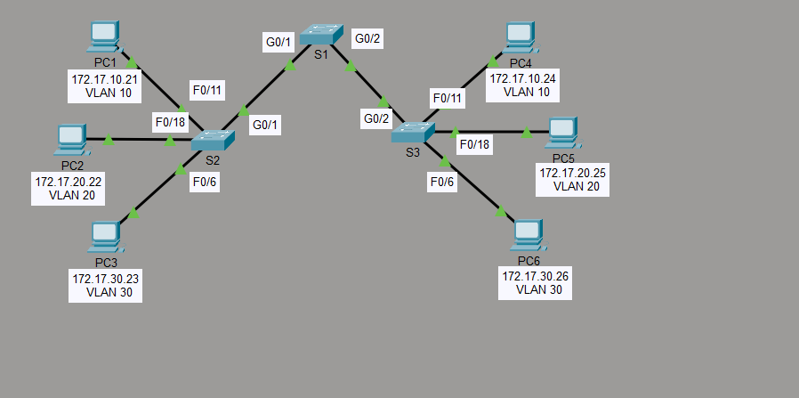

| Device | IP Address | VLAN |
|---|---|---|
| PC1 | 172.17.10.21 | VLAN 10 |
| PC2 | 172.17.20.22 | VLAN 20 |
| PC3 | 172.17.30.23 | VLAN 30 |
| PC4 | 172.17.10.24 | VLAN 10 |
| PC5 | 172.17.20.25 | VLAN 20 |
| PC6 | 172.17.30.26 | VLAN 30 |

**Trunk Links:** S1 G0/1 ↔ S2 G0/1 · S1 G0/2 ↔ S3 G0/2

---

## 🛠️ Configuration Steps

### Step 1 — Display the Current VLANs on Each Switch

Before configuring trunks, verify the existing VLAN assignments on each switch.

**S1:**
```
S1# show vlan brief
```

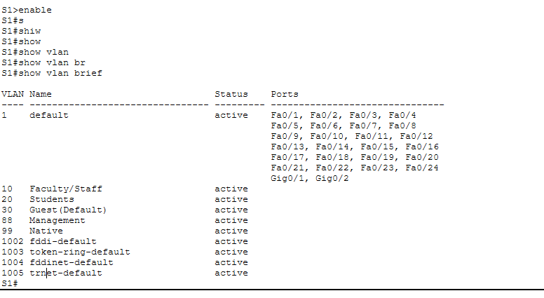

**S2:**
```
S2# show vlan brief
```

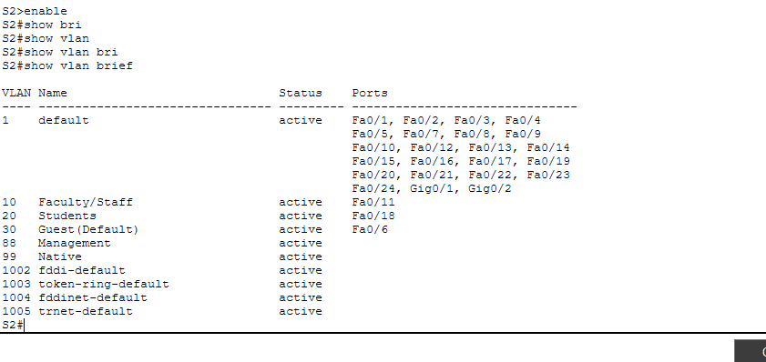

**S3:**
```
S3# show vlan brief
```

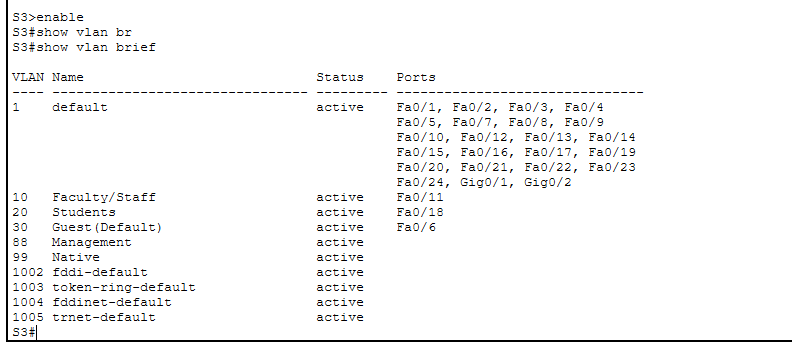

> All three switches already have VLANs 10, 20, 30, 88, and 99 defined. S2 and S3 have access ports assigned (Fa0/11 → VLAN 10, Fa0/18 → VLAN 20, Fa0/6 → VLAN 30). S1 has no access port assignments since it only carries trunk links.

---

### Step 2 — Verify Loss of Connectivity Between PCs on the Same Network

Before trunk links are configured, pings between PCs in the same VLAN across different switches fail because tagged frames cannot traverse the uplinks.

```
C:\>ping 172.17.10.24   (PC1 → PC4, both VLAN 10)
C:\>ping 172.17.30.10   (PC3 → PC6, both VLAN 30)
```

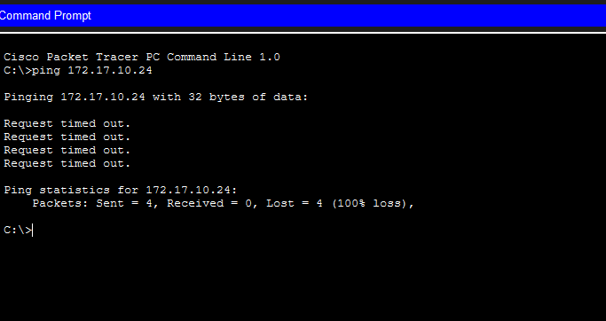

All pings result in **100% packet loss** — confirming that without trunks, inter-switch VLAN traffic is blocked.

---

### Step 3 — Configure Trunking on S1

Set both uplink ports (G0/1 and G0/2) to trunk mode, then assign VLAN 99 as the native VLAN on G0/1:

```
S1(config)# interface range g0/1 - 2
S1(config-if-range)# switchport mode trunk

S1(config)# interface g0/1
S1(config-if)# switchport trunk native vlan 99
```

The interfaces cycle down then back up as they renegotiate in trunk mode.

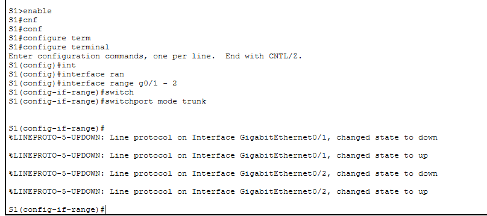

---

### Step 4 — Use VLAN 99 as the Native VLAN on S1 G0/2

Set VLAN 99 as the native VLAN on the second trunk port of S1 as well:

```
S1(config)# interface g0/2
S1(config-if)# switchport trunk native vlan 99
```

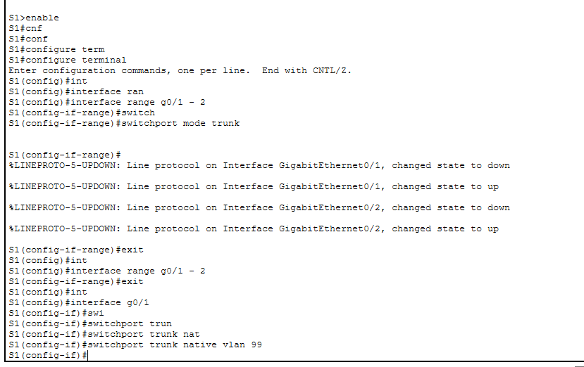

---

### Step 5 — Correct the Native VLAN Mismatch on S2

Before correction, S2's trunk port shows native VLAN 1 (the default). This causes a CDP native VLAN mismatch warning with S1 (which is already set to 99). Fix it by setting VLAN 99 on S2's G0/1:

```
S2(config)# interface g0/1
S2(config-if)# switchport trunk native vlan 99
```

STP unblocks the port on VLAN 99 and restores port consistency automatically.

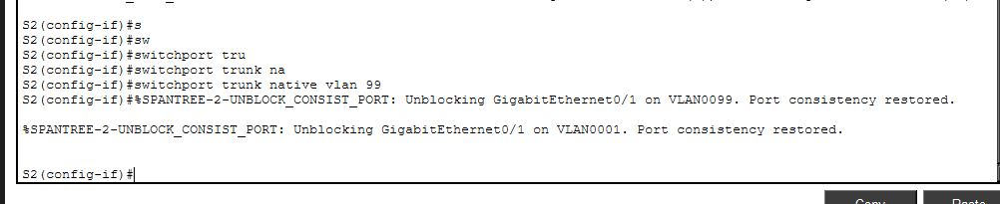

---

### Step 6 — Correct the Native VLAN Mismatch on S3

Similarly, S3's G0/2 defaults to native VLAN 1. Setting it to VLAN 99 resolves the mismatch with S1:

```
S3(config)# interface g0/2
S3(config-if)# switchport trunk native vlan 99
```

> **Note:** A CDP native VLAN mismatch warning and STP PVID error appear briefly while S3 still has native VLAN 1. These clear once both ends match.

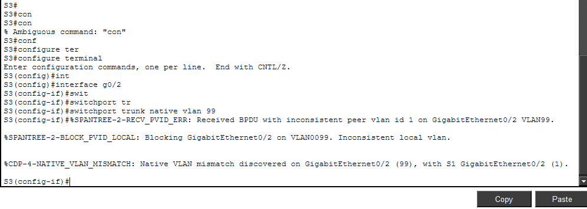

---

## ✅ Verification

### Verify Trunking is Enabled on S2

```
S2# show interfaces trunk
```

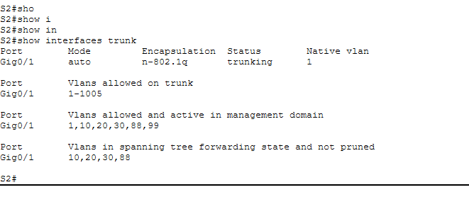

Confirm that Gig0/1 shows:
- **Mode:** auto → trunking
- **Encapsulation:** n-802.1q
- **Native VLAN:** 99
- **VLANs active in management domain:** 1, 10, 20, 30, 88, 99

---

### Verify Trunking is Enabled on S3

```
S3# show interfaces trunk
```

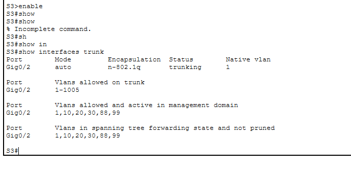

Confirm that Gig0/2 shows:
- **Mode:** auto → trunking
- **Encapsulation:** n-802.1q
- **Native VLAN:** 99
- **VLANs active in management domain:** 1, 10, 20, 30, 88, 99

---

### Verify Full Configuration on S2

```
S2# show interfaces trunk
```

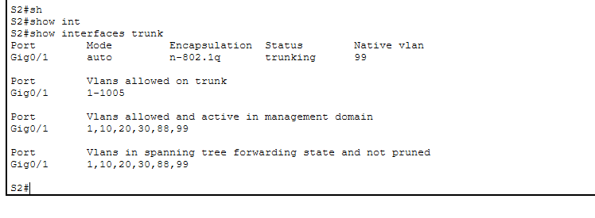

Native VLAN is now **99** on Gig0/1, confirming the mismatch has been corrected.

---

### Verify Full Configuration on S3

```
S3# show interfaces trunk
```

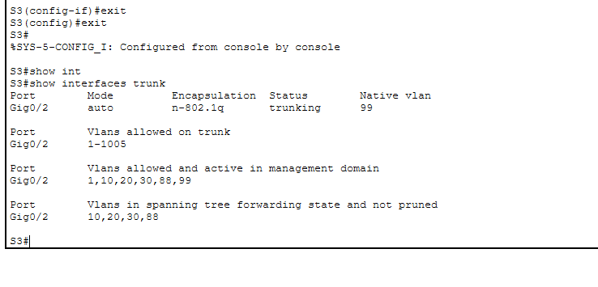

Native VLAN is now **99** on Gig0/2, confirming the mismatch has been corrected.

---

## 📌 Key Concepts

| Concept | Detail |
|---|---|
| **Trunk link** | A switch port that carries traffic for multiple VLANs simultaneously |
| **802.1Q** | IEEE standard for VLAN tagging on trunk links (n-802.1q in Cisco) |
| **Native VLAN** | The VLAN whose frames are sent untagged across a trunk link |
| **Native VLAN mismatch** | Occurs when both ends of a trunk are set to different native VLANs — triggers CDP warnings and STP PVID errors |
| **`switchport mode trunk`** | Forces a port into permanent trunk mode |
| **`switchport trunk native vlan`** | Assigns the native (untagged) VLAN on a trunk port |
| **`show interfaces trunk`** | Displays trunk status, encapsulation, native VLAN, and allowed VLANs |
| **VLAN 99** | Used as the Management & Native VLAN throughout this lab |

---

## 📁 Repository Structure

```
.
├── 3_4_5_Packet_Tracer_-_Configure_Trunks.pka
├── README.md
└── ScreenShots/
    ├── Topology.png
    ├── Display-the-current-VLANs-on-S1.png
    ├── Display-the-current-VLANs-on-S2.png
    ├── Display-the-current-VLANs-on-S3.png
    ├── Verify-loss-of-connectivity-between-PCs-on-the-same-network.png
    ├── Configure-trunking-on-S1.png
    ├── use-VLAN-99-as-the-native-VLAN.png
    ├── Correct-the-native-VLAN-mismatch-on-S2.png
    ├── Correct-the-native-VLAN-mismatch-on-S3.png
    ├── Verify-trunking-is-enabled-on-S2.png
    ├── Verify-trunking-is-enabled-on-S3.png
    ├── Verify-configurations-on-S2.png
    └── Verify-configurations-on-S3.png
```

---

## 🚀 Getting Started

1. Open Cisco Packet Tracer
2. Load `3_4_5_Packet_Tracer_-_Configure_Trunks.pka`
3. Run `show vlan brief` on each switch to review the pre-configured VLAN assignments
4. Attempt a ping between same-VLAN PCs on different switches — confirm it fails
5. Configure trunk mode and native VLAN 99 on S1, then correct S2 and S3 to match
6. Run `show interfaces trunk` to verify all trunk links are up with native VLAN 99
