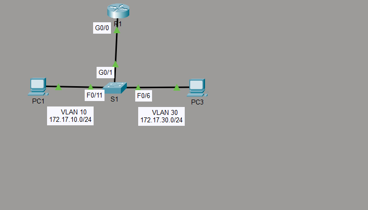
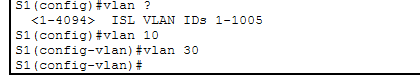
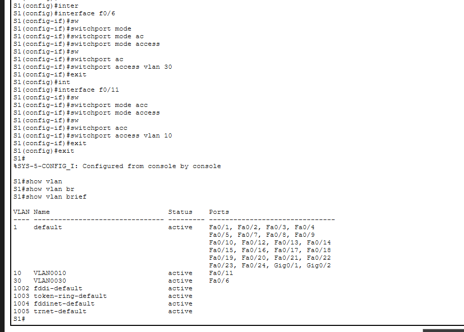
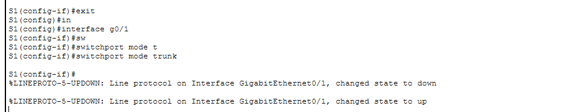
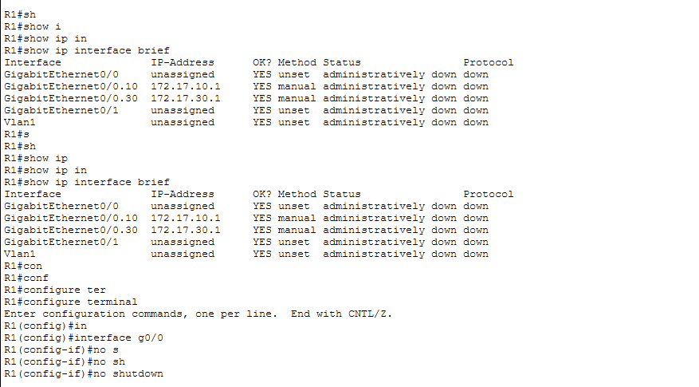
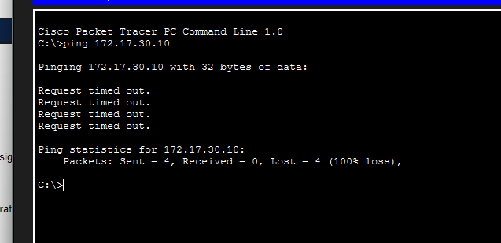
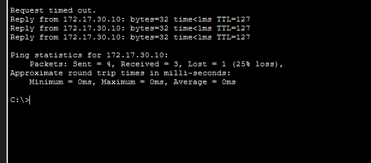

# 🛣️ 4.2.7 Configure Router-on-a-Stick Inter-VLAN Routing — Cisco Packet Tracer Lab

> Inter-VLAN routing using 802.1Q subinterfaces on a single router uplink, enabling communication between VLAN 10 and VLAN 30 through a trunk link to S1.

---

## 📋 Overview

This lab demonstrates the Router-on-a-Stick method for inter-VLAN routing. A single physical link from router R1 to switch S1 is configured as a trunk, and two subinterfaces (G0/0.10 and G0/0.30) are created with 802.1Q encapsulation to act as the default gateways for each VLAN. Without this configuration, PCs on different VLANs cannot communicate even through the same switch.

**File:** `4_2_7_Packet_Tracer_-_Configure_Router-on-a-Stick_Inter-VLAN_Routing.pka`  
**Platform:** Cisco Packet Tracer  
**Devices:** Cisco Router R1 · Cisco Switch S1 · PC1 (VLAN 10) · PC3 (VLAN 30)

---

## 🖧 Network Topology



| Device | Network | VLAN | Gateway |
|---|---|---|---|
| PC1 | 172.17.10.0/24 | VLAN 10 | 172.17.10.1 |
| PC3 | 172.17.30.0/24 | VLAN 30 | 172.17.30.1 |

**Key Links:**  
- R1 G0/0 → S1 G0/1 (trunk)  
- S1 F0/11 → PC1 (access, VLAN 10)  
- S1 F0/6 → PC3 (access, VLAN 30)

---

## 🛠️ Configuration Steps

### Step 1 — Create VLANs on S1

Enter global configuration mode on S1 and create VLAN 10 and VLAN 30:

```
S1(config)# vlan 10
S1(config)# vlan 30
```



---

### Step 2 — Assign and Verify VLANs to Ports on S1

Assign access ports to their respective VLANs, then verify with `show vlan brief`:

```
S1(config)# interface f0/6
S1(config-if)# switchport mode access
S1(config-if)# switchport access vlan 30
S1(config-if)# exit
S1(config)# interface f0/11
S1(config-if)# switchport mode access
S1(config-if)# switchport access vlan 10
S1(config-if)# exit
```

```
S1# show vlan brief
```



Confirm that Fa0/11 is assigned to VLAN 10 and Fa0/6 is assigned to VLAN 30.

---

### Step 3 — Enable Trunking on S1 G0/1

Configure the uplink port connecting S1 to R1 as a trunk so that tagged frames for both VLANs can travel across the single link:

```
S1(config)# interface g0/1
S1(config-if)# switchport mode trunk
```

The interface cycles down then back up as it transitions to trunk mode.



---

### Step 4 — Configure Subinterfaces on R1 Using 802.1Q Encapsulation

On R1, create a subinterface for each VLAN on the G0/0 physical interface. Each subinterface gets an 802.1Q encapsulation tag matching its VLAN ID and an IP address that serves as the default gateway for that VLAN:

```
R1(config)# interface g0/0.10
R1(config-subif)# encapsulation dot1Q 10
R1(config-subif)# ip address 172.17.10.1 255.255.255.0

R1(config)# interface g0/0.30
R1(config-subif)# encapsulation dot1Q 30
R1(config-subif)# ip address 172.17.30.1 255.255.255.0
```


---

### Step 5 — Enable the Physical Interface on R1

The subinterfaces come up only when the parent physical interface is active. Bring G0/0 up with `no shutdown`:

```
R1(config)# interface g0/0
R1(config-if)# no shutdown
```



After enabling G0/0, both subinterfaces become active. Verify with `show ip interface brief` — G0/0.10 should show 172.17.10.1 and G0/0.30 should show 172.17.30.1.

---

## ✅ Verification

### Test Connectivity — Before Configuration (100% Loss)

Before trunking and subinterfaces are fully configured, a ping from PC1 to PC3 (172.17.30.10) across VLANs fails completely:



All 4 packets time out — VLANs are isolated with no inter-VLAN routing path.

---

### Test Connectivity — After Configuration (Successful)

After enabling the G0/0 physical interface on R1, re-run the same ping:



3 out of 4 packets succeed (the first times out while ARP resolves). Inter-VLAN routing is now fully operational through the router-on-a-stick subinterfaces.

---

## 📌 Key Concepts

| Concept | Detail |
|---|---|
| **Router-on-a-Stick** | A single physical router interface handles routing for multiple VLANs via subinterfaces |
| **Subinterface** | A logical subdivision of a physical interface (e.g., G0/0.10, G0/0.30) |
| **802.1Q encapsulation** | Tags frames on subinterfaces with a VLAN ID so the router identifies each VLAN |
| **`encapsulation dot1Q <vlan-id>`** | Required on each subinterface — binds it to a specific VLAN |
| **Default gateway** | Each VLAN's subinterface IP address acts as the gateway for hosts in that VLAN |
| **`no shutdown` on parent interface** | Subinterfaces cannot come up unless the physical interface is active |
| **Trunk to router** | The switch port connecting to R1 must be in trunk mode to carry tagged frames for all VLANs |
| **`show ip interface brief`** | Verifies subinterface IP addresses and operational status on R1 |

---

## 📁 Repository Structure

```
.
├── 4_2_7_Packet_Tracer_-_Configure_Router-on-a-Stick_Inter-VLAN_Routing.pka
├── README.md
└── ScreenShots/
    ├── Topology.png
    ├── Create-VLANs-on-S1.png
    ├── Assign-and-Verify-VLANs-to-ports.png
    ├── Enable-trunking.png
    ├── Configure-subinterfaces-on-R1-using-the-802_1Q-encapsulation.png
    ├── Verify-Configuration.png
    ├── Test-connectivity-between-PC1-and-PC3.png
    └── Test-Connectivity-after-Enabling.png
```

---

## 🚀 Getting Started

1. Open Cisco Packet Tracer
2. Load `4_2_7_Packet_Tracer_-_Configure_Router-on-a-Stick_Inter-VLAN_Routing.pka`
3. Create VLANs 10 and 30 on S1 and assign them to the correct access ports
4. Set S1 G0/1 to trunk mode for the uplink to R1
5. Configure 802.1Q subinterfaces G0/0.10 and G0/0.30 on R1 with their gateway IPs
6. Bring up R1's G0/0 physical interface with `no shutdown`
7. Ping from PC1 (VLAN 10) to PC3 (VLAN 30) to verify inter-VLAN routing works
